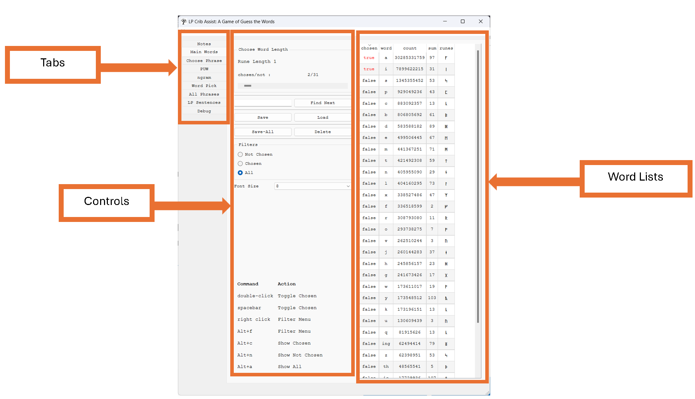
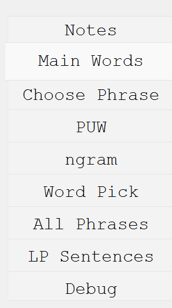
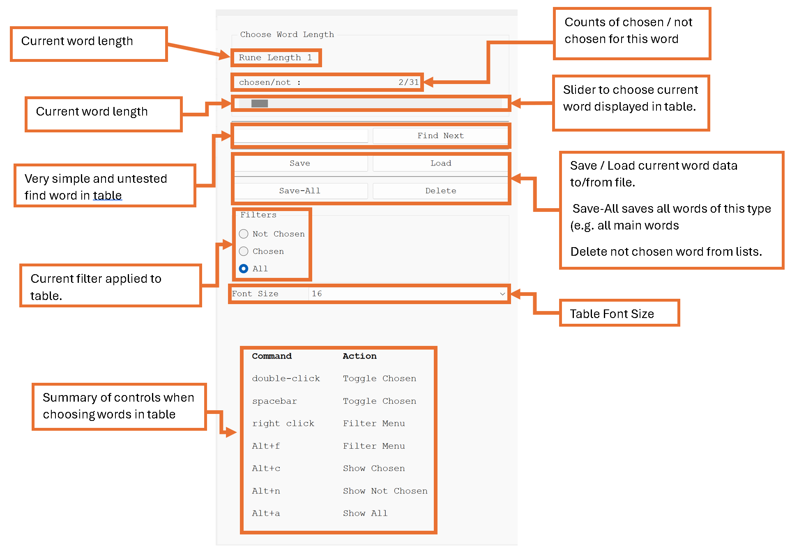
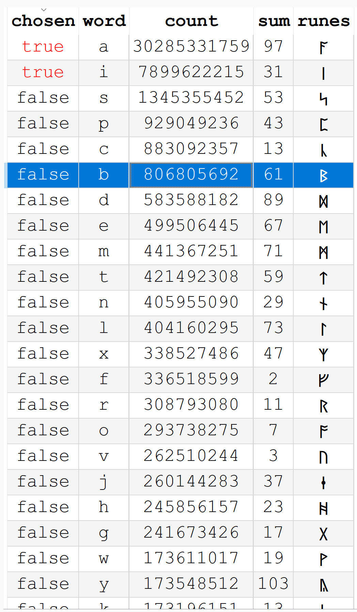

#  Liber-Primus-Crib-Assistant
It's a game of guess the words. 

**Welcome to the documentation.**


## Table of Contents

- [Overview](#overview)
- [Main files and Path Definitions](#Main-files-and-Path-Definitions)
- [Quickstart - Installation](#Quickstart-Installation)
  - [Windows](#Quickstart-Installation-Windows)
  - [Linux](#Quickstart-Installation-linux)
- [Quickstart - Tutorial](#Quickstart-Tutorial)
  - [super quick](#Quickstart-Tutorial-super-quick)
- [File formats](#File-formats)
  - [App-Configuration](#File-formats-App-Configuration)
  - [Main-words](#File-formats-Main-words)
  - [Raw-ngrams](#File-formats-Raw-ngrams)
  - [Phrase](#File-formats-Phrase-Phrase)
  - [Phrase-ngrams](#File-formats-Phrase-ngrams)
  - [Phrase-Unique-Words](#File-formats-Phrase-Unique-Words)
- [Gui-Overview](#Gui-Overview")
  - [Tabs](#Gui-Overview-Tabs)
  - [Main-Word-Controls](#Gui-Overview-Main-Word-Controls)
  - [Table-View-of-Data-Objects](#Table-View-of-Data-Objects)
- [License](#license)


## Overview  <a name="Overview"></a>

- Liber-Primus-Crib-Assistant is an application designed to help crib words and phrases found in the unsolved pages of Liber Primus. 
- It aims to provide a simple interface to lists of pre-defined word data.;
- Enable users to filter and chose / not choose different word combinations for phrases that fit the word structure of the Liber Primus. 
- Generate crib lists to be used for further offline processing, or as data to be passed to decrypting attempts, (create a fake solution for the plaintext) etc. 


This app is still in development, basic features are working, but there is plenty of oppertunity for further improvements to the code and features.   In the current verison the basic achitecture, data object definitions and interactions through a GUI are being tested.  There is plenty of scope for further features to be added but first that will depend on if it useful and if it works as intended.   


## Main files and Path Definitions  <a name="Main-files-and-Path-Definitions"></a> 

All paths are relative to the application folder. If installed to a folder called "Liber-Primus-Crib-Assist" the windows binary would be at  "./bin/win/LPCribAssist.exe". The main folder structure with some example files should look something like this: 

```html
Liber-Primus-Crib-Assist  [Applcation Root Directory ]
├─ bin/[binaries direcTory ]
│  ├─ win/	
│  │  ├─ LPCribAssist.exe [windows executable ] 	
├─ assets [MOVE ] 	
├─ doc [documetation directory ] 	
├─ data/
│  ├─ n_grams/	
│  │  ├─ 2-grams/				
│  │  │  ├─ 1 2.txt	[1 2 ngrams data file]
│  │  │  ├─ 1 3.txt	[1 3 ngrams data file]
│  │  │  ├─ ... 	
│  ├─ 1_grams_full / [1 grams dat directory (most complete wordlists) ]
│  ├─ phrases/[phrases ]
│  │  ├─ 1 8/ [Tutorial phrase 1 8 ]
│  │  │  ├─ 0_1 8.txt [data file for 1st ngram in phrase (0_) and ngram word lengths (1 8)]
│  │  │  ├─ phrase_config.ini [This phrases configuraiton file ]
│  │  │  ├─ puw_0.csv [data for for the 1st phrase unique words ]
│  │  │  ├─ puw_1.csv [data for for the 2nd phrase unique words ]
│  ├─lp_sents_2023.txt [dat for rune words, word lengths for each sentence in the sovled pages ]
├─ source/ [c++ source files ]
├─ config.ini  [main app config, plaintext, can be edited as needed ]
├─ README.md
├─ LICENSE
├─ LPCribAssist.pro [qmake file for compilaiton ]
├─ ...
```
 
File types (csv, txt, ini,  etc are what they are, all word data is held in what can be though of as csv fiels, and ini data is key,value pair data that are all read by the c++ parser. (At a future date these may be rationalised or abstracted). 
 
 
## Quickstart - Installation <a name="Quickstart-Installation"></a>

Download the repository to your local PC.  

### Windows  <a name="Quickstart-Installation-Windows"></a>

A compiled executable and other binary files are shared as part of the project simply run  "./bin/win/LPCribAssist.exe"

### linux <a name="Quickstart-Installation-linux"></a>
As is often usual for linux users the best solution is to compile the source yourself. QT libraries and any dependancies are required for the build. If you use the QT developer tools (QT Creator) this should not be difficult, if you use your own tool-chain it may be. QT provides a .run file [https://download.qt.io/], for large linux distributions the package manager probably has a version and you can always build QT itself from source. When the LP-Crib-Assist is run raw data files are typically loaded using relative paths that assume the main executabale is contained two folders lower from the root directory. This means that placing the compiled binaries in a folder such as ./bin/linux/ is advised. This can be configured using the config.ini in the applications and by passing the path to config file on startup. I am very happy to help as best I can with installation.   
 
## Quickstart - Tutorial  <a name="Quickstart-Tutorial"></a>

### super-quick  <a name="Quickstart-Tutorial-super-quick"></a>

A quick example using a single 2-gram with word lengths 1-8.  (More complex examples would have multiple n-grams overlapping one another.) 

1.**Choose a new phrase**.
- In the "choose phrase tab" enter 1 8 (or 1,8) and press enter. 
- The required file "../../data/n_grams/2-grams/1 8.txt" will be written to the "File to look for" text box. 
- If files are written to the "Missing Files" either the paths aren't configured correctly or the files are missing. 
- A phrase consists of meta-data, the lengths of words, the number of ngram, the starting index of the ngram in the phrase, the number of words in the phrase, the number of words in each n-gram, etc.
- A "phrase meta data" overview will be displayed at the bottom of the window. This is a represention of the data required to define all the objects in the phrase.   

2. **Create the new phrase data and write files (only if a suitable phrase has been entered).**
- If it is anticpated that the "phrase meta data" can be succesfully processed the "cretae new phrase" button will be green and can be pressed. 
- When activated a pop up window should open at the "New Phrase" root directory. A new directory should be created in which to save the phrase data files being created. Once selected the app will run through the setup procedure.

3. **Setup procedure**
- Using the "phrase meta data" a series of structured data objects are created. These contain lists of words or n-gram phrases and a chosen status for each entry, and described below.  
  - **Load ngram files**
    - Load "./data/2-gram/1 8.txt"  
  - **Cut the entries that contain words "not chosen" in the main-words lists**
    - Cut all ngrams that do not have "a" or "i" as first word.
  - **From the loaded n-gram data find the "phrase unique words" for each word-index in the phrase.**
    - Each word in a phrase has a "phrase unique word" object. The 1-8 test phrase has two "phrase unique word" objects. From the cut n-gram data the 1st word in the phrase is "a" or "i". Therefore, the 1st "phrase unique word" data object contains the words ["a","i"]. The 2nd "phrase unique word" contains all the unique items from 2nd length 8 word in the cut ngram data.  
  - **Write phrase save files**
    - files are created for the ngram data and the "phrase unique words" updates made to the data  should be saved to allow for  
  
4. **Words and/or ngrams are chosen / not chosen by interacting with the tables**
  - As well as the "phrase unique word" containing words ["a", "i"] they also have a "chosen" list containing [True, True].  The ngram data also has "chosen" list as long as the number of  entries. The chosen status for entries in the "ngram tab" or the "puw tab"  "phrase_unique words" can be toggled by using the mouse / keyboard controls. Filters can be set to view "chosen" "not chosen" or "all" words for any list. For longer phrases, different "phrase unique word" or ngrams data sets can be selected using the slider.  

5. **Rationalize the "phrase unique word" and n-gram data**
- (e.g) The word lists are rationalized by using the combination of "phrase unique word" and "ngram" chosen values for each entry to decide which words are still chosen. 
- In order to do this consistently the ngram data objects have another list of "chosen by phrase unique words"  flags. The ngram has a flag for each word in its phrase. For ngram 1-8 this means there is a nested list of length 2 lists, that would look like [[True, True],[True, True],[True, True],...] The number of entries is the number of ngram phrases. The values of these flags are set by the corresponding "phrase unique word" chosen status. 
- If either of "ngram chosen" or "chosen by puw" are False the ngram will be set to "not chosen." 
- On rationlization the "phrase unique word" objects take precedence.  
- This is best explained with an example. Suppose "a" has been set "chosen"  and "i" is "not chosen" and the ngram phrases before and after  rationalization with the 1st "phrase unique word" the data would look like:

| Phrase     | ngram chosen | puw chosen| chosen by puw
|------------|:-----:|:-----------:|:-----:|:-----------:|
| a constant | [True] | [True, True] | [True]
| i remember | [True] | [True, True] | [True]
| a positive | [True] | [True, True] | [True]
 

| Phrase     | ngram chosen | puw chosen| chosen by puw
|------------|:-----:|:-----------:|:-----:|:-----------:|
| a constant | [True] | [True, True] | [True]
| i remember | [False] | [False, True] | [False]
| a positive | [True] | [True, True] | [True]

- If "i remember" is subsequently set to "chosen" on the ngram tab, and "i" is still set to "not chosen", it will revert to "not chosen" on the next raitonalization.  If it is wanted to keep  "i remember" chosen in genrtal then "i" will have to be chosen in the "phrase unique word" object.

6. **All-pick tab**

- When the number of possible words has been reduced this tab can be useful to try and pick out an exact crib. So far, Minimal development time has been spent here.    

7. **All phrases tab**
- At some point the number of unique phrases  that are still chosen should reach a numerb that can be printed to screen / file in a reaosnabel amount of time. These crib lists could be used for further offline processing, or as cribs-lists to be passed to decrypting attempts. When this happens and if it even works as intended in the current version is not fully known at the time of writing. 


## File formats  <a name="File-formats"></a>

### App Configuration <a name="File-formats-App-Configuration"></a> 

Main configuration information is loaded on startup. It's a simple text file  using a [key-word] = [value] syntax. In this example paths are relative to the default application executable. The app expects 14 main word files, their exact name is configurable but the format must be the same as defined below.      

```
path_to_lp_sentences=../../data/lp_sents_2023.txt
path_to_raw_1grams../=../data/1_grams-debug
path_to_raw_ngrams=../../data/n_grams
path_to_phrase_save_root=../../data/phrases
path_to_last_phrase=../../data/phrases/test
load_last_phrase_on_startup=true
raw_1grams_01=raw1grams_01.csv
raw_1grams_02=raw1grams_02.csv
raw_1grams_03=raw1grams_03.csv
raw_1grams_04=raw1grams_04.csv
raw_1grams_05=raw1grams_05.csv
raw_1grams_06=raw1grams_06.csv
raw_1grams_07=raw1grams_07.csv
raw_1grams_08=raw1grams_08.csv
raw_1grams_09=raw1grams_09.csv
raw_1grams_10=raw1grams_10.csv
raw_1grams_11=raw1grams_11.csv
raw_1grams_12=raw1grams_12.csv
raw_1grams_13=raw1grams_13.csv
raw_1grams_14=raw1grams_14.csv
```

### Main-words (1-grams) <a name="File-formats-Main-words"></a> 

The main-words are the "complete" set of possible words, split into groups by their number of runes (1 to 14, as 14 is the longest word in the Liber Primus). Currently there are three different sets of main words shared (each with a different purpose) :

```html
data 
├─ 1_grams-full/  [the complete list of words are here]
├─ 1_grams-cut/   [A working  list of words i am making cuts to]
├─ 1_grams-debug/ [To run faster during debugging use these. Not advised for solving]
debugging the app. If debugging the app it is recommended to use this or something similar.    
```

The application expects 14 main-word word raw data files, with names defined in the config.ini. The format of the files is csv (for strings use of a " start/end tag is optional). Each line should containg a new word with the following column order (column labels should not be added to the file):  
English spelling, Counts, Chosen status, Runeglish Spelling, Gematria Sum  

| English spelling     | Counts | Chosen status | Runeglish Spelling |Gematria Sum  | 
|:------------:|:-----:|:-----------:|:-----:|:-----------:|

Below is an example from the 1-gram word list (raw1grams_01.csv). The 1 rune words a and i are chosen and other words are not. there are multiple words that have the same spelling in Runelgish (e.g. u and v) This is not a problem, in general words are chosen using the english spelling. The sentences "V is my favorite letter." and "U is my favorite letter." are different in English but not in runes.   
:
```
a,30285331759,1,ᚪ,97
i,7899622215,1,ᛁ,31
s,1345355452,0,ᛋ,53
p,929049236,0,ᛈ,43
c,883092357,0,ᚳ,13
b,806805692,0,ᛒ,61
d,583588182,0,ᛞ,89
e,499506445,0,ᛖ,67
m,441367251,0,ᛗ,71
t,421492308,0,ᛏ,59
n,405955090,0,ᚾ,29
l,404160295,0,ᛚ,73
x,338527486,0,ᛉ,47
f,336518599,0,ᚠ,2
r,308793080,0,ᚱ,11
o,293738275,0,ᚩ,7
v,262510244,0,ᚢ,3
j,260144283,0,ᛂ,37
h,245856157,0,ᚻ,23
g,241673426,0,ᚷ,17
w,173611017,0,ᚹ,19
y,173548512,0,ᚣ,103
k,173196151,0,ᚳ,13
u,130609439,0,ᚢ,3
q,81915626,0,ᚳ,13
ing,62494414,0,ᛝ,79
z,62398951,0,ᛋ,53
th,48565541,0,ᚦ,5
io,17729936,0,ᛡ,107
ia,16870355,0,ᛡ,107
ea,13811698,0,ᛠ,109
ae,8451074,0,ᚫ,101
oe,4859024,0,ᛟ,83
```


### Raw ngrams  <a name="File-formats-Raw-ngrams"></a> 

Precomputed lists of word n-grams are used to build phrases. Currently only 2-grams are included, more are avialable here [https://github.com/mortlach/google_ngrams_Version-20200217]. Users can add their own files as long as they  match the required format. One idea to try is to get books from project runeberg that match the style you are interested in and then use them as the base data. 
 : 

```html
data/
├─ 2_grams/	
│  ├─ 2-grams/				
│  │  ├─ 1 2.txt [1 2 ngrams data file]
│  ├─ 3-grams/	 [ not supplied]			
│  ├─ 4-grams/	 [ not supplied]			
│  ├─ 5-grams/	 [ not supplied]			
```

The file name must match the rune length of the words in the file. E.g. A file names "3 12.txt" must contain lists of 2-grams with 3 then 12 runes per word. 2-gram file must contain two words, a 3-gram file must contain 3 english words. Raw ngrams files just contain the english spelling of the words and a count.  

| English spelling     | Counts |  
|:------------:|:-----:|


```
and consequently 43276681
and particularly 25737921
and international 23263962
and subsequently 15867407
and universities 13564950
for consideration 12243832
and communication 11607661 
...
```

### Phrase Phrase  <a name="File-formats-Phrase-Phrase"></a> 

Each phrase contains a configuraiton file that defines the "phrase meta data" and the files that hold the word lists. It enables phrases to be saved and worked on over time. Configuration information is loaded on selecting load phrase from the menu phrase. It's a simple text file  using a [key-word] = [value] syntax. In this example paths are relative to the default application executable. These are defined when the phrase confgiguration file is first saved. They would be easy to manually change if need be. Loading and saving phrase with significantly different paths has not been robsutly tested. 


```
[General]
ngram0_ngram_root_dir=../../data/n_grams
phrase_word_lengths="1,8"
ngram0_raw_filepath=../../data/n_grams/2-grams/1 8.txt
phrase_tokens="1,8"
ngram0_raw_filename=1 8.txt
ngram_lengths=2
has_sent_end=false
has_sent_start=false
ngram0_phrase_dir=../../data/phrases/1 8
ngram0_phrase_ngram_filename=0_1 8.txt
ngram_token_lengths=2
ngram0_phrase_ngram_filepath=../../data/phrases/1 8/0_1 8.txt
puw0_word_index_in_phrase=0
ngram0_phrase_tokens="1,8"
puw0_word_length=1
ngram0_phrase_word_indices=
puw0_filename=puw_0.csv
ngram0_phrase_word_lengths="1,8"
puw1_word_index_in_phrase=1
ngram0_ngram_word_indices="0,1"
puw1_word_length=8
ngram0_ngram_tokens="1,8"
puw1_filename=puw_1.csv
ngram0_ngram_length=2
ngram0_word_start_index=0
ngram0_raw_file_exists=true
ngram0_has_sent_start=false
ngram0_has_sent_end=false
ngram0_ngram_index=0
```

### Phrase ngrams  <a name="File-formats-Phrase-ngrams"></a> 

For a defined phrase, the "phrase unique words" required ngram-word files are copied into the phrase directory and extar columns are added (explained below). The names of the files are generated by the app. They are prepended by the order of this ngram in the phrase. For a  phrase with word lengths 3-12-5 there wre two 2-grams 3-12 and 12-5 so the phrase ngram files will be called "puw_1.csv" and "1_12 5.txt" repectively.  For thsi length ngram the file data looks like:


| Ngram word 1  | Ngram word 2 | chosen by word 1  | chosen by word 1  | ngram chosen | counts | chosen |
|:--:|:-----:|:----:|:----:|:----:|:----:|:---:|

```
and,consequently,1,1,1,43276681,1
and,particularly,1,1,1,25737921,1
and,international,1,1,1,23263962,1
and,subsequently,1,1,1,15867407,1
and,universities,1,1,1,13564950,1
...
```

### Phrase Unique Words   <a name="File-formats-Phrase-Unique-Words"></a> 

For a defined phrase of X words are X "phrase unique words". They are either chosen or not chosen and have a count based on the number of ngrams they occur in.  

| PUW | Total Count in ngrams  | Total number of ngram   containing this word |  chosen |
|:--:|:----:|:----:|:---:|

```
a,18446744072272321071,12719,1
i,268337417,8113,1
```


## GUI Overview <a name="Gui-Overview"></a> 

Here an overview of the GUI controls will be given. Over time GUI's develop so the exact layout may change and new functionality can be added. Ideally, this should not effect existing features. 
The GUI is laid out with tabs on the left handside which can be selected to interact with different features. Many of these tabs are for interacting with the wordlists, 1 tab is for generating a new phrase, and 1 tab contains a sumamry of the LP primus sentences and word lengths. Other tabs are either in development or helplful during debugging.   

### Startup View Overview <a name="Gui-Overview-Startup-View-Overview"></a> 

On startup the main-words tab should be selected and this should be the typical view:  
   
#### Tabs <a name="Gui-Overview-Tabs"></a> 

Each tab is explained below 
Notes: TODO
Main Words: The unique words from 1 to 14 runes, used as the base chosen / not chosen words when creating a new phrase.
PUW: The "phrase unique words" for the current phrase.  
ngram: The ngrams for the current phrase.  
Word Pick: Drop down menu for eahc word in the phrase. Used for creating unique solutions. Plenty of oppertunity for extre features   
All Phrase: (If possible) a list of all possible phrases (each combination of each "phrase unique word" in the phrase). ATM Not well defined or coded but has been seen to work.  
LP Sentences: List of each sentence and thier word lengths
Debug: Not used for now, may pipe logging text to to this screen in the future.    

 

#### Main Word Controls  <a name="Gui-Overview-Main-Word-Controls"></a> 

For the three word lists there are always the following basic controls.  

 

   
#### Table View of Data Objects <a name="Gui-Overview-Table-View-of-Data-Objects"></a>

The data associated with each of the three types of word lists (main-words, "phrase unique words" and ngrams) is displayed with an interactive table. Sorting can be done by clicking the column headers. Currently three filters can be applied to the data, and future features can expand on thes. Multiple items can be selected by using a shift key. Toggling thr chosen / not chosen can be achieved by double clicking or pressing alt-f /  alt-t.  Below is an example table for the 1-gram main words. 

 

